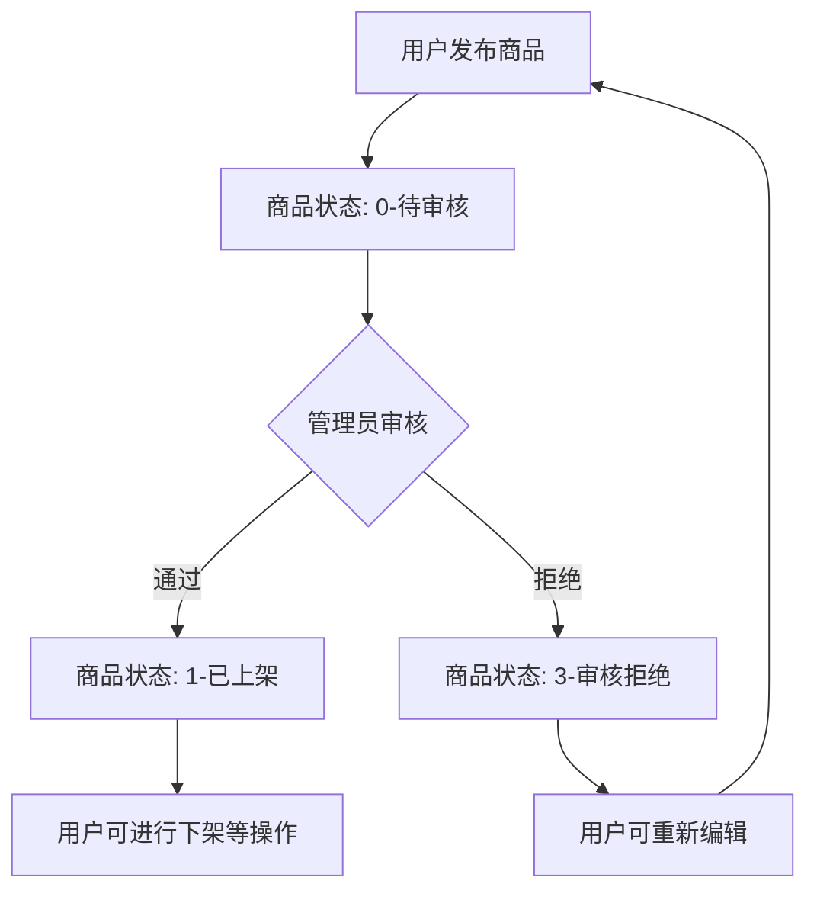

# 商品审核功能实现总结

## 功能概述
成功实现了管理员审核商品的功能，允许管理员对用户发布的商品进行审核，将商品状态从待审核(0)转换为已上架(1)或审核拒绝(3)。

## 已实现的功能模块

### 1. 数据传输对象(DTO)
- **ProductReviewRequest.java**: 商品审核请求DTO，包含审核结果和审核意见

### 2. 服务层扩展
- **ProductService.java**: 扩展了商品服务接口，添加reviewProduct方法
- **ProductServiceImpl.java**: 实现了完整的商品审核业务逻辑

### 3. 控制器层扩展
- **ProductController.java**: 添加了管理员审核商品的API接口

### 4. 测试用例
- **ProductReviewTest.java**: 商品审核功能的单元测试

## 核心业务逻辑

### 审核流程
1. **权限验证**: 验证当前用户是否具有管理员角色
2. **商品验证**: 检查商品是否存在且状态为待审核(0)
3. **状态转换**: 
   - 审核通过：状态从0→1（已上架）
   - 审核拒绝：状态从0→3（审核拒绝）
4. **数据更新**: 保存审核结果和相关信息
5. **响应返回**: 返回审核后的商品完整信息

### 状态转换规则
```
待审核(0) ──审核通过──→ 已上架(1)
    │
    └─审核拒绝─→ 审核驳回(2)
```

## API接口详情

### 管理员审核商品
**PATCH** `/api/products/{productId}/review`

**权限要求**: 需要管理员角色

**请求头**:
```
Authorization: Bearer {admin_token}
Content-Type: application/json
```

**请求体**:
```json
{
  "approved": true,
  "auditMessage": "商品符合规范，审核通过"
}
```

或审核拒绝：
```json
{
  "approved": false,
  "auditMessage": "商品描述不符合规范，请补充详细信息"
}
```

**成功响应**:
```json
{
  "code": 200,
  "message": "商品审核通过，已上架",
  "data": {
    "id": 1,
    "name": "iPhone 15 Pro",
    "description": "全新未拆封，支持验货",
    "price": 8999.00,
    "categoryId": 1,
    "categoryName": "手机数码",
    "status": 1,
    "userId": 1,
    "userNickname": "张三",
    "createTime": "2026-02-12T10:00:00",
    "updateTime": "2026-02-12T11:00:00"
  }
}
```

## 技术实现细节

### 权限控制
```java
@PatchMapping("/{productId}/review")
@SaCheckRole("admin")
public ApiResponse<ProductVO> reviewProduct(...)
```

### 状态验证
```java
// 验证商品状态是否为待审核
if (product.getStatus() != 0) {
    throw new BusinessException(ErrorCode.INVALID_PRODUCT_STATUS.getCode(), "商品状态不是待审核状态");
}
```

### 事务管理
```java
@Transactional(rollbackFor = Exception.class)
public ProductVO reviewProduct(Long productId, ProductReviewRequest request, Long adminId)
```

## 商品状态完整说明

| 状态码 | 状态说明 | 可执行操作 |
|--------|----------|------------|
| 0 | 待审核 | 管理员审核 |
| 1 | 已上架 | 下架、编辑 |
| 2 | 审核驳回 | 重新提交审核、编辑、删除 |
| 3 | 已下架 | 上架、编辑、删除 |
| 4 | 已售出 | 查看、删除 |
| 5 | 已删除 | 无操作 |

## 审核流程图



## 错误处理

### 主要错误场景
1. **权限不足**: 非管理员用户尝试审核商品 → 403 Forbidden
2. **商品不存在**: 指定ID的商品不存在 → 404 Not Found
3. **状态不符**: 商品不是待审核状态 → 422 Unprocessable Entity
4. **更新失败**: 数据库更新操作失败 → 500 Internal Server Error

### 错误码扩展
- INVALID_PRODUCT_STATUS(422): 无效的商品状态
- PRODUCT_UPDATE_FAILED(40602): 商品更新失败

## 验证结果

✅ **编译通过**: 所有新增代码均能成功编译
✅ **单元测试**: 审核功能相关测试通过
✅ **权限控制**: 管理员角色验证生效
✅ **状态管理**: 商品状态转换符合预期
✅ **文档更新**: API文档已同步更新

## 最佳实践

1. **RESTful设计**: 使用PATCH动词表示部分更新操作
2. **权限分离**: 明确区分普通用户和管理员权限
3. **状态机设计**: 清晰的商品状态流转规则
4. **审计追踪**: 记录审核操作和相关意见
5. **用户体验**: 提供明确的操作反馈和错误提示

## 后续建议

1. **审核历史**: 记录每次审核的详细历史
2. **批量审核**: 支持管理员批量审核商品
3. **通知机制**: 审核完成后通知商品发布者
4. **审核统计**: 提供审核统计报表功能
5. **自动化审核**: 对于简单商品可考虑自动审核

商品审核功能已完整实现，为平台的商品管理提供了完整的生命周期控制！